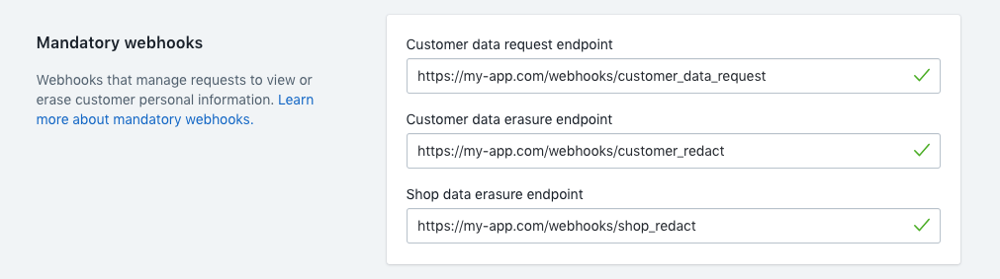

# Handle Shopify Mandatory Webhooks in Ruby on Rails

Since May 25th, 2018 GDPR has imposed obligations on any party that collects, stores, or processes personal data. App developers have the responsibility to comply with these regulations. Fortunately, Shopify has implemented endpoints to help app developers deal with data privacy to meet the requirements of GDPR.

Read about [Shopify API GDPR requirements](https://help.shopify.com/en/api/guides/gdpr-resources).

## Mandatory Webhooks

Mandatory webhooks differ slightly from regular webhooks from Shopify. If you're using the *shopify_app* gem you can use the [webhooks manager](https://github.com/Shopify/shopify_app#webhooksmanager) to configure your apps needed webhooks. Unfortunately this only works for the regular Shopify admin API events, the mandatory webhooks have to be set up manually. This doesn't mean the app gem can't help us out, we'll still use it for verifying webhooks, more on that later.

Read about [getting started with Shopify webhooks](https://help.shopify.com/en/api/getting-started/webhooks).

## Mandatory Webhooks Controller

Create a new controller called `MandatoryWebhooksController`. This controller will have three methods, an endpoint for each mandatory webhook.

Create (`app/controllers/mandatory_webhooks_controller.rb`):

```rb
class MandatoryWebhooksController < ApplicationController
  
  def shop_redact
  end

  def customer_redact
  end

  def customer_data_request
  end
  
end
```

Create a private method that only excepts only the params we want and returns them. The `except` method returns a hash with everything except for the given values.

```rb
private
  def webhook_params
    params.except(:controller, :action, :type)
  end
```

Now we can use `webhook_params` in our controller methods to access the data sent by the webhook request.

### Webhook Verification

Webhooks need to be verified before being processed to be sure that the request came from shopify and not someone else.

In the header of the request, Shopify includes an HMAC. This is the SHA256 digest calculated from the body of the request and your apps shared secret. To verify the webhook you have to calculate this HMAC and compare it to the one in the request header, if they match then it is a valid webhook from Shopify.

Shopify's [getting started with webhooks guide](https://help.shopify.com/en/api/getting-started/webhooks#verify-webhook) has a good section on how to manually verify webhooks.

Luckily the [shopify_app gem](https://github.com/Shopify/shopify_app) can handle this for us, no need to worry about calculating and compare the HMAC. To do this include ShopifyApp::WebhookVerification at the start of the controller class.

```rb
class MandatoryWebhooksController < ApplicationController
  include ShopifyApp::WebhookVerification
  ...
end
```

### Complete the endpoint methods

Start by setting the params permitted attribute to true, then we can use `webhook_params` to do whatever we want with the webhook data.

Then we need to return a response to Shopify to say everything is okay. Mandatory webhooks need to respond with a 200 series status code. Calling `head :no_content` will respond with a `"204 no content"` status. We aren't sending any data back to Shopify with these webhooks so 204 just indicates that the webhook was received and there's nothing to send back.

```rb
def shop_redact
  params.permit!
  # do something
  head :no_content
end
```

Before `head` is called we can do whatever we want with the webhook data. We can log a ticket in your support system or send yourself an email with data.

## Routes

Now that the webhooks can be processed we need to set up routes that Shopify can post to when a webhook is fired. We can make the endpoint locations be whatever we want, then map them to the appropriate controller methods.

```rb
controller :mandatory_webhooks do
  post '/webhooks/shop_redact' => :shop_redact
  post '/webhooks/customers_redact' => :customers_redact
  post '/webhooks/customers_data_request' => :customers_data_request
end
```

We then have to go into our apps set up in the partners dashboard and find the mandatory webhooks section. Here we specify the URLs for each webhook endpoint.



Shopify can now send a mandatory webhook to our app and we will verify it and respond accordingly.

## Jobs

One thing we might want to do is process the webhooks using ActiveJob instead of doing everything inline in the controller.

Create a job for each webhook like this (`app/jobs/shop_redact_job.rb`):

```rb
class ShopRedactJob < ActiveJob::Base
  def perform(shop_domain:, webhook:)
    shop = Shop.find_by(shopify_domain: shop_domain)

    shop.with_shopify_session do
      # redact information related to this shop
    end
  end
end
```

In this job, we can do all the processing we want like creating support tickets, deleting database information, sending emails, etc.

Lastly, we need to queue the job when the webhook is received. Modify the controller methods for each endpoint like this:

```rb
def shop_redact
  params.permit!
  ShopRedactJob.perform_later(shop_domain: shop_domain, webhook: webhook_params.to_h)
  head :no_content
end
```

Now ActiveJob will handle the heavy lifting of the webhook and we don't have to worry about having the main app do extra processing.