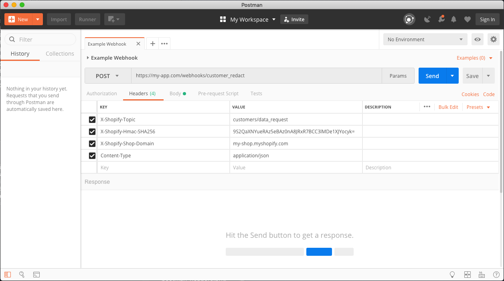
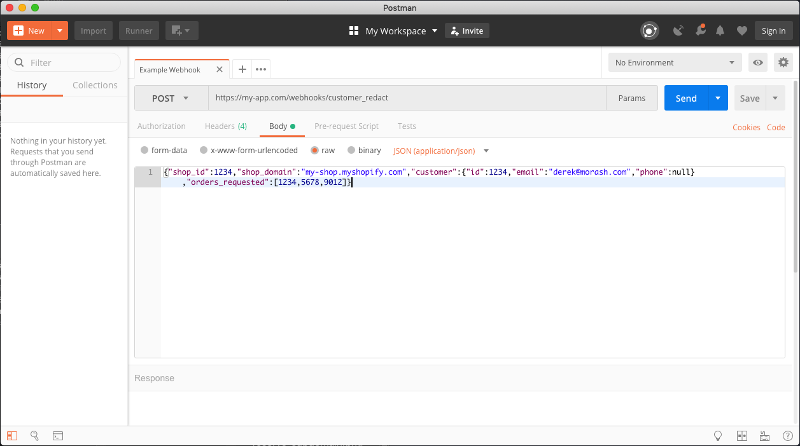

```rb
require "OpenSSL"
require "Base64"

shopify_app_secret = '1234'
webhook_payload = '{"shop_id":1234,"shop_domain":"my-shop.myshopify.com","customer":{"id":1234,"email":"derek@morash.com","phone":null},"orders_requested":[1234,5678,9012]}'

calculated_hmac = Base64.encode64(OpenSSL::HMAC.digest('sha256', shopify_app_secret, webhook_payload)).strip

# calculated_hmac returns => "9S2QaXNYueRAz5eBAz0nA8JRxR7BCC3lMDe1XJYocyk="
```



